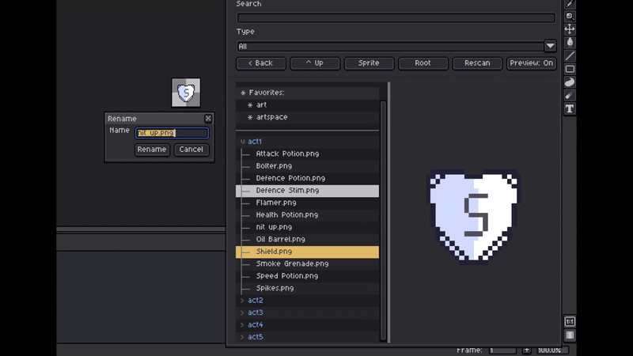

# Aseprite File Tree

| Light Theme | Dark Theme |
|:-:|:-:|
|  |  |



A lightweight Aseprite extension that opens a floating file tree browser. It shows nested folders and common art files in a tree view, then opens a clicked file in Aseprite. The browser respects the active Aseprite theme so it blends in with both light and dark skins.

## Install

1. Run `.\build-extension.ps1`.
2. Open Aseprite.
3. Go to `Edit > Preferences > Extensions`.
4. Add `aseprite-file-tree.aseprite-extension`.
5. Restart Aseprite if the command does not appear immediately.

## Verify

Run `.\run-tests.ps1` for filesystem behavior tests, then `.\build-extension.ps1` and `.\verify-extension.ps1` for the packaged extension checks.

## Use

Open `File Tree` from Aseprite's script/plugin menu. The root path defaults to the last saved path, then to Aseprite's user documents folder.

### Controls

```text
< Back    Return to the previous root folder.
^ Up      Use the parent folder as the root.
Sprite    Use the current sprite's folder as the root.
Root      Navigate to the pinned root folder (set via right-click).
Rescan    Reload folder contents.
Preview   Toggle the right-side file preview pane.
```

The tree checks cached and expanded folders for external filesystem changes once per second. Rescan remains available as a full manual refresh.

### Mouse Interactions

- **Single-click** a folder to expand or collapse it.
- **Single-click** a file to select (highlight) it.
- **Double-click** a file to open it in Aseprite.
- **Double-click** a folder to drill into it as the new root.
- **Right-click** a folder to create a new file or folder, cut/copy/paste, set root, add/remove favorite, copy path, or reveal it in the system file manager.
- **Right-click** empty tree space to create a new file or folder in the current root.
- Copy Path and Reveal work on Windows, macOS, and Linux.
- New files ask for a name and file type before they are created.
- **Right-click** a file or folder and choose "Rename" to rename it.
- **Right-click** a file or folder and choose "Cut" or "Copy", then paste it into a folder or empty tree space.
- **Drag** a file or folder onto another folder to move it. Hold **Ctrl** while dragging to copy it.
- Drop an item on the Root row or empty tree space to move or copy it into the current root folder.
- Rename keeps the original file extension when you omit one, and uses a typed extension when you include one.
- **Right-click** a file or folder and choose "Delete" to permanently delete it after confirmation. Folder deletion is recursive.
- Use **Preview** to show or hide the right-side preview pane. When preview is on, single-click a file to preview its first frame.
- Drag the divider between the tree and preview pane to resize the preview. Hovering the divider switches to Aseprite's horizontal resize cursor.
- The tree refreshes automatically after creating, renaming, or deleting files and folders.
- **Right-click** the Root label to clear the pinned root.
- **Mouse wheel** or **scrollbar** to scroll. **Shift + wheel** for horizontal scroll.

### Keyboard Shortcut

Go to **Edit → Keyboard Shortcuts**, search for **File Tree**, and assign a key to toggle the browser open/closed.

### Search & Filter

- **Search** field filters files and folders by name (debounced 1.5s).
- **Type** dropdown filters by file extension (.png, .ase, etc).
- When a type filter is active, only files matching the type appear; folders show only as ancestors of matching files.

### Favorites

- Right-click a folder and choose "Add Favorite" to pin it.
- Favorites appear in a panel at the top of the tree.
- Double-click a favorite to navigate to it.
- Right-click a favorite to remove it.

### Supported Files

```text
.ase, .aseprite, .png, .jpg, .jpeg, .gif, .webp, .bmp
```

## Notes

This is a floating dialog because the public Aseprite extension API does not expose native docked editor tabs.
